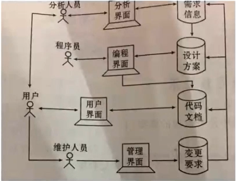
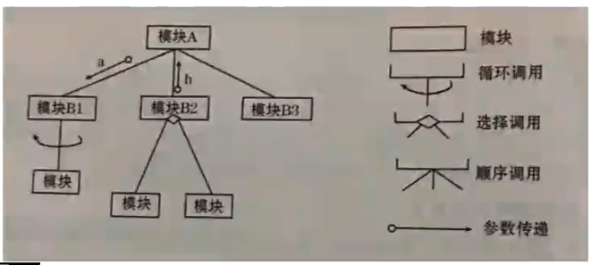
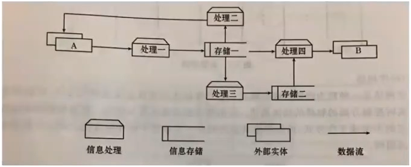

# 软件开发工具

# 第一章

## 1.1软件开发工具的由来

**软件开发工具的产生**：

​	软件开发工具是计算机技术发展的产物。它以计算机自身处理信息能力为基础，在软件开发各个阶段，对软件开发的各个方面提供了各种各样的帮助。从而成为软件工作人员必须具备的重要技术手段

考点1:**软件开发工具的定义:**

​	软件开发工具的范围大致可以描述为：*在高级程序设计语言*（**第三代语言**）的基础上，为提高软件开发的质量和效率，从规划、分析、设计、测试、文档和管理等各方面，对软阿金开发者提供各种不同程度的帮助的一类新型软件

> 第二代 汇编
>
> 第一代 机器

考点2:**识记软件开发工具的发展过程（几个阶段）：**

- `机器语言阶段`
  - 使用0,1代码进行编程
- `汇编语言阶段`
  - 使用助记符来编写程序，由汇编系统将汇编指令转化为机器指令，编程工作量大大降低，**但仍未摆脱对硬件的依赖**。与此同时，操作系统的出现从另一方面改善了人们应用计算机的条件
- `高级语言阶段`
  - **时间：20世纪60年代初期**
  - 高级语言突破了与机器指令的一一限制，实现类对机器的独立性，从而大大提高了程序的可移植性。
- `第四代语言阶段`
  - 人们希望机器能够自动的完成更多的工作，包括自动安排某些工作的顺序，而做到只要给机器下达做什么的命令，由机器自己去安排执行的顺序
- *利用通用软件作为辅助工具的阶段*
  - 利用文字处理软件来编写文档，利用绘图软件来绘制流程图等等
  - **时间：20世纪70年代末-20世纪80年代初**
- *专用软件开发工具阶段*
  - 支持软件开发的某一个阶段或某一个环节
- *集成的软件开发工具阶段*
  - 零散的，分散的支持各种工作阶段、各项具体工作的专用工具之间没有有机的联系起来，从而必然造成冲突与矛盾，以致抵消了使用工具的益处。这种情况促使了集成软件开发工具的产生

考点：`问答题`

考点2 软件开发工具及应用的必然性及发展趋势

**软件开发工具的产生应用的必然性**：

​		**硬件是计算机的躯体，软件是计算机的灵魂**。软件是广大使用与计算机之间的桥梁，软件是人类在各个领域积累的知识的结晶。正由于软件在当今社会的突出地位，软件工作的重要性越来越受到人们的重视，**故软件开发工具的产生和应用也是必然的，是软件技术发展到一定阶段的必然产物。**

**软件开发工具的发展趋势**：

​		**第一个特点是面向网络**，不经基于网络，而且用于网络。**另一个特点是开源软件的兴起和运用**。对软件开发人员来说，对开源软件的利用和关注是绝对需要的，其对于开发工作下效率的提高是肯定是有益的。

## 1.2软件开发的概念

考点1 **领会软件与软件开发工作的实质**	

​		软件的实质：
​		软件用来指看不见、摸不着的，但又发挥着十分重要的作用的，事先编好的指令序列。从应用的角度来看，软件一端连着计算机硬件，向硬件提供可执行的机器指令，另一端面向用户，接受用户提出的要求和算法。软件的实质在于应用环境和业务流程的正确理解和描述，而不是简单的编程.

考点2 **软件开发工具的发展主要表现在以下四个方面**：

1. 自动化程度的提高。
2. 这一阶段的工作明确的把需求分析和架构设计包括在软件工作范围之内，从而使软件开发过程进一步向用户方面延伸，离用户更近了。 *通用工具*
3. 把软件开发工作延伸到项目及版本管理，从而超出了一次编程的局限，而扩展到了作为一个不断发展的客体生长完善的全过程
4. 在这一阶段的研究中，吸收了许多管理科学的内容与方法、如程序员的组织、质量的控制 ，领会软件开发工具的概念、地位、及作用

考点3 

**软件开发工具的概念**: 

​		在高级程序设计语言（**第三代语言**）的基础上，*为提高软件开发的质量和效率，从规划、分析、设计、测试 、文档、和管路等方面，对软件开发者提供不同程度的帮助的一类新型的软件*

要点：

1. 是高级程序设计语言之后，软件技术进一步发展的产物
2. 目的是在于人们开发软件时给予各种不同方面、不同程度的支持和帮助
3. 它支持软件开发的全过程，而不是仅限于编码或者其他稳定的工作阶段。

**软件开发工具的地位:**

​		他的提出和使用，是软件技术发展的一个新阶段，它是发展的必然趋势，是软件技术发展到一定阶段的必然产物。

**软件开发工具的作用：***
		软件开发工具可以提高软件开发的效率，保证软件开发的质量和开发的周期，同时使系统更加规范，而且节省人力财力。

## 1.3 软件开发工具的功能和性能

考点1 **软件开发的过程**：**

> 1. **第一阶段是初始要求的提出**。是软件开发工作的起点
> 2. **第二阶段是总体设计**。它的任务是根据软件功能说明书的需求，完成软件总体设计，包括整个软件的结构设计，公用的数据文件或数据库的设计，各部分的连接方式及信息交换的标准等主要内容
> 3. **第三阶段是实现阶段。**实现阶段包括程序的编写与文档的编写 。软件的概念应当是程序加文档，没有文档的程序是无法推广和使用的。
> 4. **第四阶段是测试和调试阶段**。其中包括模块的调试与整个软件的联调。模块的测试和系统的测试

考点2 **软件开发工具主要有五项基本功能：****

> 1. **认识与描述客观系统** 这主要用在软件开发工作的第一个阶段-需求分析阶段。
>
> 2. **存储及管理开发过程中的信息 ** 在软件开发各个阶段都要产生及使用许多信息。有些信息其他阶段还要使用，谷信息的保存管理问题显得非常突出.
> 3. **代码的编写或生成 **在软件开发的过程中，程序编写过程占了相当比例的人力，物力和时间，提高代码的编制速度与效率显然是软件工作的一个重要方面。
> 4. **文档的编制或生成** 
> 5. **软件项目管理** 

考点3 **软件开发工具的主要性能指标**：

> 1. 表达能力和描述能力
> 2. 保持信息一致性的能力
> 3. 使用的方便程度
> 4. 工具的可靠程度
> 5. 对软件和硬件环境的要求

## 1.4 软件开发工具的类别*

考点1 **支持不同工作阶段的三种工具**

软件开发工具分为三类：**计划工具、分析工具、设计工具**

从工作的抽象程度来看

> - 设计工具是最具体的，它是指在实现阶段对人们提供帮助的工具
> - 分析工具主要指用于支持需求分析的工具
> - 计划工具从更宏观的角度看待软件开发

考点2 **单项工具与集成工具的区别**

​		单项工具是指专用的、面向某一工作阶段或某工作任务的工具；集成工具是指集成化的、面对软件开发的全过程工具

考点3 依赖于机器或软件的工具与独立于机器或软件的工具的区别

> 分析工具与计划工具是独立于机器和软件的。而集成化的软件开发工具又常常是依赖于机器和软件的

# 第二章 软件开发过程及其组织

## 2.1 软件开发的困难

考点1 **软件开发中的两个转换过程**

1. 用户对软件功能的理解与程序员对软件功能的理解之间的转换
2. 程序员的理解与程序的实现之间的转换

考点2 **大型软件开发中的困难**

- 一致性的保持
- 测试的问题
- 工作进度的控制
- 文档与代码的协调
- 版本更新带来的问题

考点3 **困难产生的原因**

1. 大系统的复杂性（根本原因）
2. 多人协同工作的组织管理
3. 领域知识和软件技术
4. 时间因素及变更因素

## 2.2 软件开发方法的发展

考点1 **结构化程序设计的思想方法**

它遵循以下几条原则：自顶向下、逐层分解设计，每个程序只有单一入口，单一出口；在模块内只有三种基本语句结构：**顺序结构、选择结构和循环结构**；限制使用GOTO语句等领会软件工程的基本思想与方法。

考点2 **软件工程的基本思想与方法**

> 从组织和管理的角度加强力量，从根本上提高软件开发的效率和质量领会面向对象的程序设计的基本思想与方法

以工程化的方法编写软件

考点3 面向对象的程序设计的基本思想与方法可以归纳为以下几点

> 1. 把客观世界任何事物称为对象， 
> 2. 对象之间有抽象与具体，群体和个体，整体与部分等几种关系
> 3. 抽象的、较大的对象所具有的性质，包括静态属性和动态属性，自然的成为它的子类的性质，不必加以说明和规定，这就是所谓的**遗传性**     （封装 多态 继承）
> 4. 对象之间可以互传消息。可以是传参，也可以是使这个对象开始某个操作

考点4 **即会即插即用程序设计的基本思想与方法**

 即会即插即用程序设计的基本思想与方法是：

> 一部分人专门生成软件组件，另一部分人构造整个软件的结构（相当于计算机结构）并把软件组件插入这个结构

 即会即插即用程序设计实现由两个困难

1. 标准化问题。
2. 软件变得提供方式问题

### 2.3 软件开发过程的管理

考点1 **软件评价的主要方面**

> - 正确的实现所要求的功能，准确的给出预定的输出结果
> - 用户界面友好，符合实际用户的使用习惯于知识能力
> - 具有足够的速度，能在符合用户要求的时间限度内，给出所要求的处理结果
> - 据欧足够的可靠性，能够在各种干扰下保持正常的工作
> - 程序易读，结构良好，文档齐全，从而保证系统易于修改

考点2 程序员与项目组的关系

> 1. 保证严格在本模块范围呢操作，绝不使用可能干扰其他模块的命令或函数（高内聚，低耦合）
> 2. 严格按照总体设计的要求和理解去传递参数值，不随意修改其内容或含义
> 3. 对公用文件进行存取是，必须完全地、准确的按统一规定的格式去操作，不擅自改变
> 4. 使用表示符，按统一的规则，尽量使用易看出逻辑含义的名称（驼峰命名）
> 5. 严格按照统一的要求编写文档、在内容、格式、表达方式、符号上遵循项目组的统一规定
> 6. 尽量保持程序风格的一致

考点3 对软件工作组的评价

> - 有严格，成文的工作规范和文档标准，且应当为全体成员所熟知，并且切实得到遵守
> - 人员之间有严格的分工
> - 每个项目要实现制定详细的时间表，且得到严格执行

# 第三章

## 3.1 软件开发过程的信息需求

考点1 **软件开发过程中信息流通的模型**

​	软件开发过程中信息流通的模型是用需求分析阶段建立的逻辑模型，表达信息的来源、去向、存储及处理的逻辑过程。软件开发过程中的信息流通状况如图所示

考点2 软件开发过程中涉及的信息类型

- 有关系统环境、现状及需求的信息。
- 有关软件的功能涉及与物理设计的各种信息。
- 软件成果本身，包括程序和文档
- 用户对系统的各种变更需求、以及系统的各种变更的记录

考点3 **软件开发过程中要进行的信息管理有以下方面**：

1. 许多信息需要长期保存，因为不只用一次，而是需要不断更新，不断的调用
2. 在许多环节上都要进行数据的转换或加工
3. 大量的人与人之间的信息交流

考点4 **软件开发工具的理论及技术基础比较重要的有以下六项**

1. 认知科学中关于概念模式的概念与方法
2. 数据库技术的理论和方法
3. 编译技术的有关方法
4. 关于人机界面的理论与方法
5. 管理科学中关于项目管理与版本管理的理论与方法
6. 系统科学与系统工程的有关理论与方法

## 3.2 概念模式及其应用

考点1 **概念模式的意义与作用**

​		概念模式是认知科学的一个用语，指的是人们在认识事物的过程中，对于某事物或某一系统形成的、抽象的、一般化的框架。

​		概念模式是人们认识客观世界的一种方法、一种工具

考点2 简单应用巴中概念模式的意义

在软件开发中常用的概念模式有八种：**框图、结构图、数据流程图、实体关系引、数据字典、时序网络、数学与逻辑模型、计算机模拟模型、**

- 框图（流程图）
- 结构图

- 数据流程图

